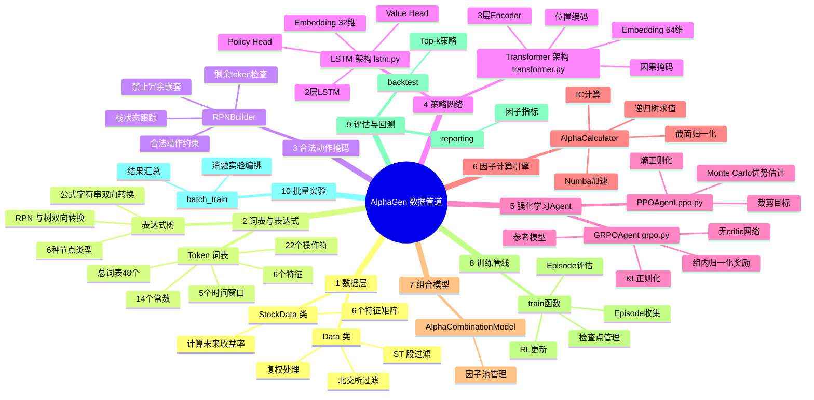

# AlphaGen — 基于强化学习的 Alpha 因子生成系统

> **论文**: *Generating Synergistic Formulaic Alpha Collections via Reinforcement Learning* (KDD 2023)
> **原版仓库**: [ICT-FinD-Lab/alphagen](https://github.com/ICT-FinD-Lab/alphagen)

---

## 🧠 数据管道思维导图



---

## 📊 数据流详解

### 阶段一：数据加载与预处理

```
CSV 文件 (D:/科大云盘/A股数据/daily/*.csv)
    │
    ▼
Data.daily() → 过滤 ST/北交所 → 复权处理
    │
    ▼
pd.DataFrame [ts_code, trade_date, open, high, low, close, vol, vwap]
    │
    ▼
StockData.__init__() → pivot 转换
    │
    ▼
dict[feature_name] → np.ndarray(shape=(n_days, n_stocks))
    │
    ├── data["open"]   ─┐
    ├── data["close"]   │
    ├── data["high"]    ├─→ 6个特征矩阵
    ├── data["low"]     │
    ├── data["vol"]     │
    └── data["vwap"]   ─┘
    │
    ▼
StockData.get_target(horizon=20)
    │
    ▼
target[t, i] = close[t+horizon, i] / close[t, i] - 1
```

### 阶段二：表达式生成（RL 循环）

```
BEG Token
    │
    ▼
┌─────────────────────────────────────────────────────┐
│  RPNBuilder (masking.py)                             │
│    │                                                 │
│    ├── 栈状态: [E, E, D, ...]                        │
│    ├── has_feature: bool                             │
│    ├── done: bool                                    │
│    │                                                 │
│    ▼                                                 │
│  get_valid_mask() → np.ndarray(shape=48, dtype=bool) │
│    │                                                 │
│    ▼                                                 │
│  Policy Network (generator.py)                       │
│    │                                                 │
│    ├── 输入: 当前 token_idx + hidden state            │
│    ├── 输出: logits (48,) + value + new_hidden        │
│    │                                                 │
│    ▼                                                 │
│  Categorical(logits[mask]).sample() → action_idx     │
│    │                                                 │
│    ▼                                                 │
│  RPNBuilder.step(action_idx)                         │
│    │                                                 │
│    ▼                                                 │
│  重复直到 done=True                                   │
└─────────────────────────────────────────────────────┘
    │
    ▼
Episode: [BEG, $close, 20, Mean, $vol, 10, Std, Div, SEP]
```

### 阶段三：因子评估与组合

```
Episode token_ids
    │
    ▼
strip_special_tokens() → [Token, Token, ...]
    │
    ▼
parse_rpn_to_tree() → ExprNode (表达式树)
    │
    ▼
tree_to_formula() → "Div(Mean($close, 20), Std($vol, 10))"
    │
    ▼
AlphaCalculator.evaluate(tree) → np.ndarray(n_days, n_stocks)
    │
    ├── 递归求值 _eval(node)
    │   ├── FeatureNode → data[feature].copy()
    │   ├── ConstantNode → np.full(value)
    │   ├── UnaryOpNode → np.abs(x) / _safe_log(x)
    │   ├── BinaryOpNode → x + y / x * y / ...
    │   ├── TSUnaryOpNode → _rolling_mean_fast(x, t)
    │   └── TSBinaryOpNode → _rolling_corr_fast(x, y, t)
    │
    ▼
_clip_and_zscore() → 归一化后的 alpha 值
    │
    ▼
AlphaCombinationModel.add_alpha(tree, alpha_values)
    │
    ├── 计算 IC with target
    ├── 计算 mutual IC with existing alphas
    ├── 检查冗余 (correlation < 0.95)
    ├── 扩展 ic_vector 和 ic_matrix
    ├── 优化权重 (解析解 / 梯度下降)
    ├── 检查 IC 提升
    └── 超容量时淘汰最弱 alpha
    │
    ▼
更新后的因子池 + 新 IC
```

### 阶段四：奖励计算与 RL 更新

```
Episode + 因子池状态
    │
    ▼
evaluate_episode() → reward
    │
    ├── simple 模式: reward = 10.0 × ic_delta
    │
    └── multi 模式:
        ├── IC 增量: 10.0 × ic_delta
        ├── ICIR 增量: 3.0 × icir_delta
        ├── Rank IC: 2.0 × candidate_rank_ic
        ├── 平衡奖励: 0.05 (正负因子平衡)
        └── 冗余惩罚: -0.5 × max_mutual (相关>0.7)
    │
    ▼
Episode.reward = reward
    │
    ▼
PPOAgent.update(episodes) / GRPOAgent.update(episodes)
    │
    ├── 展平为每步数据
    ├── 计算 advantage（Monte Carlo / 组内归一化）
    ├── 多 epoch PPO 裁剪更新
    │   ├── ratio = exp(new_log_prob - old_log_prob)
    │   ├── surr1 = ratio × advantage
    │   ├── surr2 = clamp(ratio, 1-ε, 1+ε) × advantage
    │   └── loss = -min(surr1, surr2) + value_loss - entropy_bonus
    └── 梯度裁剪 + Adam 优化
```

### 阶段五：回测与评估

```
训练完成后的因子池 (pool_best.json)
    │
    ▼
load_pool_alpha_from_file() → 加载 alpha 值和权重
    │
    ▼
组合 alpha = Σ(weight_i × alpha_i)
    │
    ▼
Backtester.run(alpha, open_prices, trade_dates)
    │
    ├── 第一天: 等权买入 top-n 只股票
    ├── 之后每天:
    │   ├── 卖出持仓中得分最低的 k 只
    │   └── 买入全市场得分最高的 k 只
    └── 计算持仓收益: open[t+2] / open[t+1] - 1
    │
    ▼
绩效指标
    ├── 总收益率
    ├── 年化收益率 = (1 + total_return)^(1/n_years) - 1
    ├── 夏普比率 = mean(daily_return) / std(daily_return) × √242
    └── 最大回撤 = max((cum_max - pv) / cum_max)
    │
    ▼
与基准对比 (如 000300.SH 沪深300)
```

---

## 📁 项目文件结构

```
alphagen/
├── common.py                  # 全局常量（数据路径、复权模式）
├── tokens.py                  # Token 词表定义（48个token）
├── expression.py              # 表达式树与 RPN 解析
├── masking.py                 # RPN 合法动作掩码
├── calculator.py              # Alpha 因子计算引擎 + IC 计算
├── lstm.py                    # LSTM 策略网络 (AlphaGenNet)
├── transformer.py             # Transformer 策略网络
├── episode.py                 # Episode 数据结构
├── ppo.py                     # PPO Agent
├── grpo.py                    # GRPO Agent
├── generator.py               # 兼容性包装器（LSTM + Transformer + Agents）
├── combination.py             # Alpha 组合模型（因子池管理）
├── train.py                   # 主训练管线 + CLI 入口
├── backtest.py                # 回测引擎
├── reporting.py               # 评估指标 + 可视化
├── batch_train_compare.py     # 批量消融实验管理器
├── data.py                    # 数据加载（A股日线CSV）
└── README.md                  # 本文件
```

---

## 🚀 快速开始

### 依赖安装

```bash
pip install torch numpy pandas matplotlib scipy numba
```

### 数据准备

将 A 股日线数据放在 `D:/科大云盘/A股数据/` 目录下（或修改 `common.py` 中的 `PATH`）：

```
D:/科大云盘/A股数据/
├── basic.csv              # 股票基本信息
├── trade_cal.csv          # 交易日历
├── daily/                 # 日线数据
│   ├── 20240101.csv
│   ├── 20240102.csv
│   └── ...
├── stock_st/              # ST 股票列表
│   ├── 20240101.csv
│   └── ...
└── market/                # 市场指数
    ├── 000300.SH.csv      # 沪深300
    └── ...
```

### 训练

```bash
# LSTM + PPO + 多目标奖励
python train.py \
    --train_start 20240101 --train_end 20251231 \
    --val_start 20260101 --val_end 20260501 \
    --model rnn --rl_algo ppo --iterations 50 \
    --device cuda --save_dir outputs

# Transformer + GRPO
python train.py \
    --model transformer --rl_algo grpo \
    --grpo_group_size 64 --grpo_kl_coef 0.04 \
    --tf_embed_dim 64 --tf_nhead 4 --tf_num_layers 3
```

### 回测

```bash
python backtest.py \
    --pool_file outputs/pool_best.json \
    --val_start 20260101 --val_end 20260510 \
    --n_hold 20 --n_swap 3 --benchmark_code 000300.SH
```

### 批量消融实验

```bash
python batch_train_compare.py \
    --models rnn transformer \
    --reward_modes simple multi \
    --seeds 42 123 456 \
    --iterations 50
```

---

## 🔧 核心超参数

| 参数              | 默认值 | 说明                               |
| ----------------- | ------ | ---------------------------------- |
| `max_seq_len`     | 20     | RPN 最大 token 数                  |
| `max_pool_size`   | 15     | Alpha 池最大容量                   |
| `lr`              | 3e-4   | Adam 学习率                        |
| `hidden_dim`      | 128    | LSTM 隐层维度                      |
| `embed_dim`       | 32/64  | Token 嵌入维度（LSTM/Transformer） |
| `ppo_epochs`      | 4      | 每个 batch 的优化 epoch            |
| `clip_eps`        | 0.2    | PPO 裁剪阈值                       |
| `gamma`           | 0.99   | 折扣因子                           |
| `entropy_coef`    | 0.01   | 熵正则化系数                       |
| `value_coef`      | 0.5    | 值函数损失系数                     |
| `grpo_group_size` | 64     | GRPO 组大小                        |
| `grpo_kl_coef`    | 0.04   | GRPO KL 正则化系数                 |

### 多目标奖励函数参数（`--reward_mode multi`）

| 参数                          | 默认值 | 说明                   |
| ----------------------------- | ------ | ---------------------- |
| `reward_ic_weight`            | 10.0   | IC 增量权重            |
| `reward_icir_weight`          | 3.0    | ICIR 增量权重          |
| `reward_rank_ic_weight`       | 2.0    | Rank IC 权重           |
| `reward_balance_bonus`        | 0.05   | 正负平衡奖励           |
| `reward_redundancy_threshold` | 0.7    | 冗余惩罚阈值（互相关） |
| `reward_redundancy_coef`      | 0.5    | 冗余惩罚系数           |
| `reward_reject_low_ic`        | -0.2   | 拒绝低IC的惩罚         |
| `reward_reject_redundant`     | -0.15  | 拒绝冗余因子的惩罚     |
| `reward_reject_no_improve`    | -0.1   | 拒绝无提升因子的惩罚   |

---

## 📚 参考文献

- [AlphaGen 论文 (KDD 2023)](https://arxiv.org/abs/2306.12964)
- [GRPO 原始论文 (DeepSeek)](https://arxiv.org/abs/2402.03300)
- [PPO 论文 (Schulman 2017)](https://arxiv.org/abs/1707.06347)
